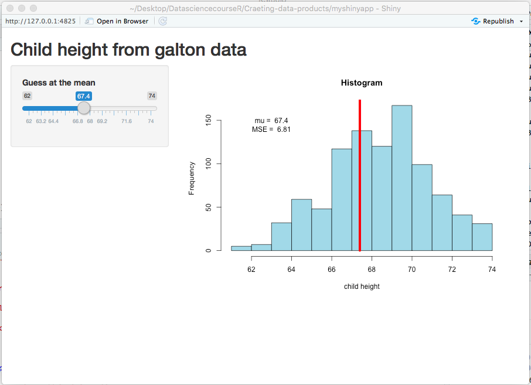

```{r setup, include=FALSE}
knitr::opts_chunk$set(echo = FALSE)
```

## Introduction 

This is an R Markdown presentation for the shiny app assignment.
The data used was the galton dataset found in the UsingR package.
- First the ui.R and server.R files are created in a specific folder.
- The two files are shown in the github.....
- The following slides explains the content of the files.


## ui.R File

-The ui.R file is used to define the user interface for plotting a histogram.
- Application title is defined using the 'titlePanel' call
- A sidebar is then created wich contains a slider the mean height can be set.
- In the main panel, a plot of the histogram of the child height is defined


## server.R
 -In the server file, the function to execute the ui,r is define.
 -First the necessary packages(shiny, UsingR) and files(galton data) are loaded.
 - the function for ploting the histogram is then defined which include the:
     -syntax to calculate the MSE
     -line through the guessed mean, 
     -text to indicate the mu and the MSE

## Output of the function


```{r, echo=FALSE}
   
```
    
